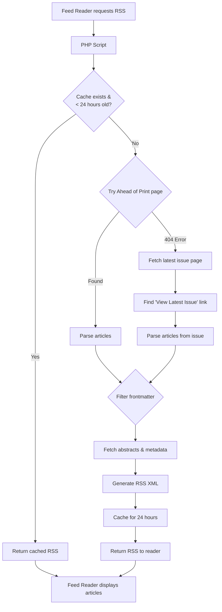

# De Gruyter/Brill RSS Feeds
[](https://doi.org/10.5281/zenodo.17847065)

Scrapes webpages of De Gruyter/Brill and turns them into RSS feeds.

## Pre-configured feeds for library and information science journals
- [ABI Technik](https://www.degruyterbrill.com/journal/key/abitech/html) via `abitech/rss.php`, served at [https://www.jensmittelbach.de/feeds/abitech/rss.php](https://www.jensmittelbach.de/feeds/abitech/rss.php)
- [Bibliotheksdienst](https://www.degruyterbrill.com/journal/key/bd/html) via `bd/rss.php`, served at [https://www.jensmittelbach.de/feeds/bd/rss.php](https://www.jensmittelbach.de/feeds/bd/rss.php)
- [Bibliothek Forschung und Praxis](https://www.degruyterbrill.com/journal/key/bfup/html) via `bfp/rss.php`, served at [https://www.jensmittelbach.de/feeds/bfp/rss.php](https://www.jensmittelbach.de/feeds/bfp/rss.php)
- [Information – Wissenschaft & Praxis](https://www.degruyterbrill.com/journal/key/iwp/html) via `iwp/rss.php`, served at [https://www.jensmittelbach.de/feeds/iwp/rss.php](https://www.jensmittelbach.de/feeds/iwp/rss.php)
- [Libri](https://www.degruyterbrill.com/journal/key/libr/html) via `libr/rss.php`, served at [https://www.jensmittelbach.de/feeds/libr/rss.php](https://www.jensmittelbach.de/feeds/libr/rss.php)
- [Open Information Science](https://www.degruyterbrill.com/journal/key/opis/html) via `opis/rss.php`, served at [https://www.jensmittelbach.de/feeds/opis/rss.php](https://www.jensmittelbach.de/feeds/opis/rss.php)
- [Preservation, Digital Technology & Culture](https://www.degruyterbrill.com/journal/key/pdtc/html) via `pdtc/rss.php`, served at [https://www.jensmittelbach.de/feeds/pdtc/rss.php](https://www.jensmittelbach.de/feeds/pdtc/rss.php)
- [Restaurator](https://www.degruyterbrill.com/journal/key/rest/html) via `rest/rss.php`, served at [https://www.jensmittelbach.de/feeds/rest/rss.php](https://www.jensmittelbach.de/feeds/rest/rss.php)
- [Rundbrief Fotografie](https://www.degruyterbrill.com/journal/key/rbf/html) via `rbf/rss.php`, served at [https://www.jensmittelbach.de/feeds/rbf/rss.php](https://www.jensmittelbach.de/feeds/rbf/rss.php)
- [The African Book Publishing Record](https://www.degruyterbrill.com/journal/key/abpr/html) via `abpr/rss.php`, served at [https://www.jensmittelbach.de/feeds/abpr/rss.php](https://www.jensmittelbach.de/feeds/abpr/rss.php)

The feeds primarily track the **ahead-of-print** sections provided by De Gruyter/Brill.
> [!NOTE]
> **Fallback Mechanism**: If the "Ahead of Print" section is empty or unavailable for a journal, the script automaticaly falls back to fetching articles from the **latest published issue**. This ensures the feed remains active and provides content even when no articles are currently in the "Ahead of Print" queue.

The scripts parse the article abstracts and metadata and expose them as RSS 2.0 feeds for easier consumption in feed readers.

## Generic endpoint for any journal
You can generate a feed for **any** De Gruyter/Brill journal by calling the new parameterised script:
```
rss.php?key=<de-gruyter-key>[&name=<optional display name>][&ttl=<cache seconds>]
```
- `key` (required): the De Gruyter journal key from the URL, e.g. `abitech` or `bfup`.
- `name` (optional): friendly journal title. If omitted, the script tries to autodetect it from the fetched page.
- `ttl` (optional): cache duration in seconds (defaults to 86400 = 24h).
- `lang` (optional): feed language tag (defaults to `en-us`). Use `de-de` to keep descriptions in German.

Examples:
- [https://www.jensmittelbach.de/feeds/rss.php?key=actap&name=Analysis+of+Current+Trends+in+Antisemitism+-+ACTA](https://www.jensmittelbach.de/feeds/rss.php?key=actap&name=Analysis+of+Current+Trends+in+Antisemitism+-+ACTA)
- [https://www.jensmittelbach.de/feeds/rss.php?key=zaa](https://www.jensmittelbach.de/feeds/rss.php?key=zaa) (uses autodetected name)
- [https://www.jensmittelbach.de/feeds/rss.php?key=dsll&lang=de-de](https://www.jensmittelbach.de/feeds/rss.php?key=dsll&lang=de-de) (German feed descriptions)

Cached responses for the generic endpoint live in `cache/<key>.json`.

## How It Works



## Suggested feed readers
- [Feedly](https://feedly.com) (Web, iOS, Android): great for cross-device syncing and powerful search/saved keyword alerts.
- [Reeder](https://www.reederapp.com) (macOS, iOS): fast native interface, handy for offline reading and integration with multiple sync backends.
- [Inoreader](https://www.inoreader.com) (Web, mobile apps): advanced filtering, rules, and team sharing when monitoring many scholarly feeds.
- [NetNewsWire](https://netnewswire.com) (macOS, iOS): lightweight open-source option that works well for a small number of personal feeds.

## Setup on remote server

1. Clone the repository to your web server:
   ```bash
   git clone https://github.com/jmiba/De-Gruyter-Brill-RSS-Feeds.git rss-feeds
   ```

2. Ensure PHP is installed and the web server is configured to serve `.php` files.

3. The scripts will be accessible at:
   - `https://example.com/rss-feeds/abitech/rss.php`
   - `https://example.com/rss-feeds/abpr/rss.php`
   - `https://example.com/rss-feeds/bd/rss.php`
   - `https://example.com/rss-feeds/bfp/rss.php`
   - `https://example.com/rss-feeds/iwp/rss.php`
   - `https://example.com/rss-feeds/libr/rss.php`
   - `https://example.com/rss-feeds/opis/rss.php`
   - `https://example.com/rss-feeds/pdtc/rss.php`
   - `https://example.com/rss-feeds/rest/rss.php`
   - `https://example.com/rss-feeds/rbf/rss.php`

4. (Optional) If running via cron/CLI, ensure execution permissions:
   ```bash
   chmod +x abitech/rss.php abpr/rss.php bd/rss.php bfp/rss.php iwp/rss.php libr/rss.php opis/rss.php pdtc/rss.php rest/rss.php rbf/rss.php
   ```

## Updating the installation

If there are changes in the git repository, you can update the files on your server by running:

```bash
git pull origin main
```
